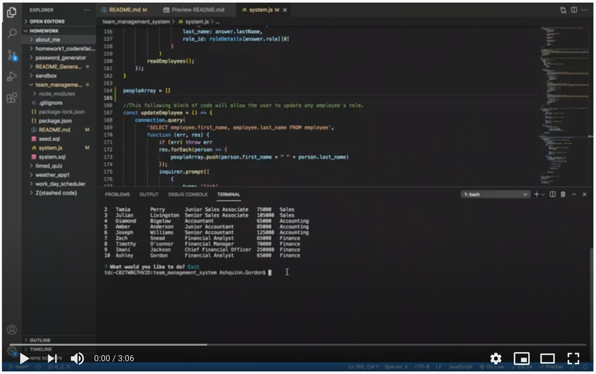

# Team Management System 

## Description
Team Management System is a command-line application that allows the user to manage and track thier employees. Users can view all the employees in thier database, add employees and assign them roles, and lastly update an employees role.

        
## Installation     
To install this application type `npm i` in the command line to install the required dependencies. Then use `node system.js` to start the application

## Technologies Used

```
Node.js
Inquirer
MySQL
```

## User Story

```
As a business owner
I want to be able to view and manage the departments, roles, and employees in my company
So that I can organize and plan my business
```
 ## Acceptance Criteria

```md
GIVEN a command-line application that accepts user input
WHEN I am prompted for information about what I want to
THEN I am given the choice to either add an employee, update an employee's role, read all my employees, or view my employees by department
WHEN I add an employee and thier role
THEN the employee is added to my database, along either thier title, salary, and department name
WHEN I update an employee's role
THEN this information is added to the employee's title, salary, and department
WHEN I choose to view all employees
THEN a table is displayed with each employee's information, including first and last name, title, salary, and department
WHEN I choose to view employees by department
THEN a table is displayed with each employee's information, including first and last name, title, and salary, from that choosen department
WHEN I choose exit
THEN the application closes 
```

## Demo 

[](https://www.youtube.com/watch?v=ljr-IS-p2EI)

## Questions       
If you have any questions please contact me by email.

* Email: ashquinngordon@gmail.com
        
## License      
Licensed under the MIT license. Use the following link for permissions and allowances:
https://opensource.org/licenses/MIT